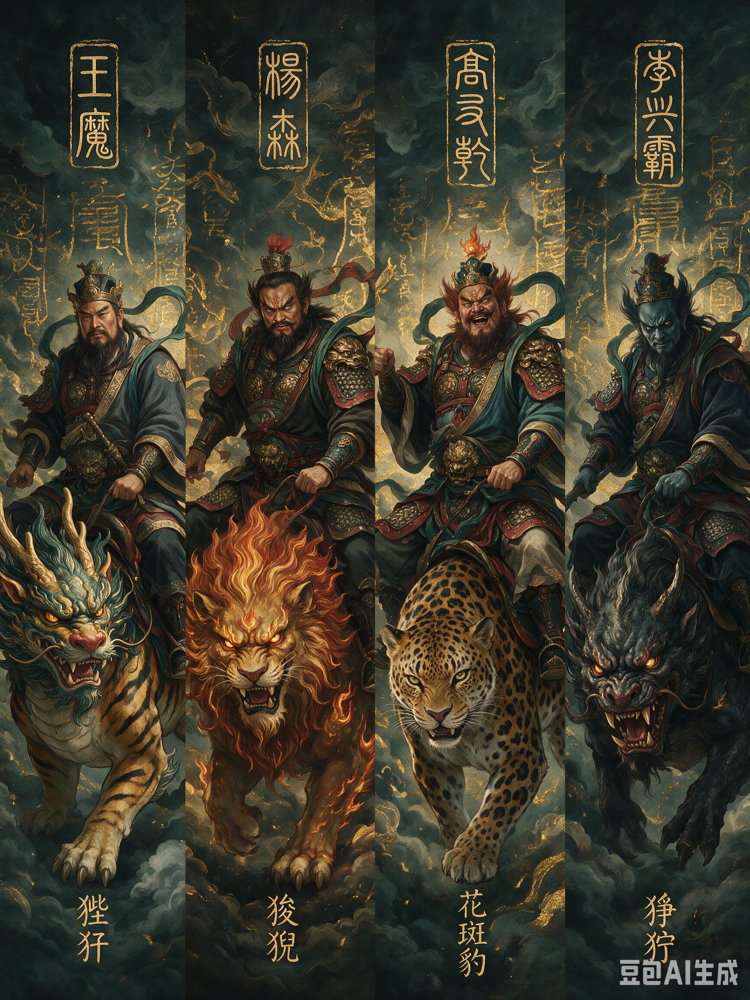
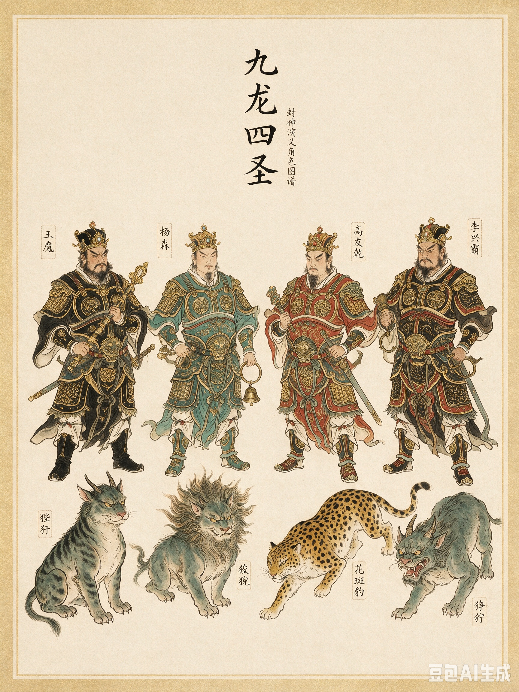

# 张桂芳西征——西岐初战

## 故事大纲
- **第 36 回**：张桂芳奉诏为征西大元帅，率十万大军杀奔西岐，先锋风林以红珠打死姬叔乾；张桂芳以"呼名落马"术擒黄飞虎、周纪、南宫适；哪吒奉太乙真人之命下山，以莲花化身破呼名落马，击伤风林、张桂芳。
- **第 37 回**：姜子牙一上昆仑，元始天尊赐封神榜，命往岐山造封神台；申公豹拦路劝烧封神榜，被南极仙翁遣白鹤童子衔头惩戒；姜子牙于东海超度柏鉴，命其监造封神台，五路神前来接应；子牙回西岐后夜劫张桂芳营，辛甲、辛免打开陷车救出周纪、南宫适，张桂芳、风林带伤退往岐山、修本告急；闻太师欲亲征而踌躇，吉立进言邀三山五岳道友相助。
- **第 38 回**：闻太师亲往西海九龙岛，请王魔、杨森、高友乾、李兴霸四圣下山；四圣入朝歌见纣王，复往西岐以丹药治愈张桂芳、风林；四圣骑异兽搦战，西岐战马骨软筋酥，姜子牙跌下马来，王魔向子牙提出三事；子牙将机就计缓兵，随即二上昆仑，元始天尊点破"七死三灾"，赐四不相、打神鞭、杏黄旗，并预告北海有人等候；子牙北海收龙须虎为徒；四圣再战，哪吒、黄飞虎被开天珠打落，龙须虎被混元宝珠打伤，李兴霸劈地珠中子牙前心，王魔以开天珠打死子牙，成就子牙"七死三灾"头一死；文殊广法天尊在五龙山拦住王魔、转述碧游宫"紧闭洞门"警示，金吒以遁龙桩缚住王魔。
- **第 39 回**：金吒一剑斩王魔，文殊广法天尊以丹药救活子牙；次日高友乾死于打神鞭、杨森被遁龙桩遁住挥为两段，风林被黄天祥枪挑；李兴霸劝张桂芳修本求救；再次日黄天祥再战张桂芳，张桂芳被周将围于垓心，金吒战李兴霸、李兴霸拍狰狞逃脱，晁田、晁雷劝降不成，张桂芳兵败自刎；李兴霸逃至九宫山，被普贤真人门徒木吒吴钩剑所杀；闻太师点左军上将军鲁雄，并借机点费仲、尤浑为参军，率兵五万再伐西岐；姜子牙以冰冻岐山之术冻住商营，命南宫适、武吉擒下鲁雄、费仲、尤浑。
- **第 40 回开篇（本篇收尾）**：子牙劝鲁雄不服、命监于后营，复上土台化冰，商军冻死三二千、余者逃入五关；子牙请武王至岐山，托言祭岐山实祭封神台，祭毕传令斩鲁雄、费仲、尤浑三人，魂入封神台。

## 故事背景
黄飞虎归周之时，文王姬昌已于此前灭崇侯虎后积劳成疾而薨——文王自羑里归国后，励精图治，广纳贤才，又经丧子之痛（伯邑考醢尸），心力交瘁；及至兵伐崇侯虎、大义灭亲之后，病势日沉，临终将世子姬发托孤于姜子牙，嘱其"善佐吾儿，待时机成熟，兴兵伐纣，完成兴周大业"。姬发嗣西伯之位，是为武王，尊子牙为尚父，凡事皆听其谋划。此时西岐军事力量骤然壮大，朝歌震动。闻太师虽坐镇中枢，却无法轻离，只得连点大将征讨西岐，其中最令西岐措手不及的，是征西大元帅张桂芳率领的第一次大规模讨伐。

张桂芳是商朝名将，不但武艺高强，更有一门令西岐众将闻之色变的异术——"呼名落马"。两军阵前，他只需呼一声对手姓名，那人便魂不附体，翻身落马。西岐寻常将领纵有万夫不当之勇，也敌不过这专摄魂魄的左道之法。他麾下先锋风林，面如蓝靛，发似朱砂，口中能吐一道黑烟，烟中藏一颗红珠，专打人脸面，中者落马。二人领十万大军杀奔西岐，在城南五里安下营寨，西岐第一次面临商朝正规军的全面进攻。

张桂芳、风林败亡之后，商朝又派左军上将军鲁雄率军五万再伐西岐，却被姜子牙以冰冻岐山之术一举擒杀。这一系列战役，是黄飞虎归周后商朝对西岐的连续打击，也是西岐从人间王朝之争转向仙道斗法的序曲。张桂芳代表的是"有异术的凡人将领"，哪吒莲花化身破呼名落马，则预示着阐教三代弟子即将成为西岐真正的倚仗。

本篇以《封神演义》第三十六回"张桂芳奉诏西征"至第三十九回"姜子牙冰冻岐山"为叙事底本。核心事件包括：张桂芳、风林先攻西岐；哪吒莲花化身破呼名落马；姜子牙两上昆仑，得封神榜、打神鞭、杏黄旗与四不相；九龙岛四圣会子牙；姜子牙冰冻岐山大挫鲁雄援军。叙事以"对比"与"关联"为方法：对比凡人武勇与左道异术的高下，关联"呼名落马"与后世神话中"点名摄魂"母题的关系。

## 正文

黄飞虎归周未久，闻太师便点青龙关总兵张桂芳为征西大元帅，率十万大军讨伐西岐。

张桂芳乃商朝名将，不但武艺高强，更有一门异术：每逢交战，他必先通名报姓，待得知对手姓名，便大呼一声"某甲，还不下马，更待何时！"那被呼唤之人便魂不附体，翻身落马。这门"呼名落马"之术，不靠刀兵，专摄人魂魄，西岐普通将领无人能敌。他麾下先锋官风林，也是左道旁门出身，面如蓝靛，发似朱砂，口中能吐一道黑烟，烟中藏一颗红珠，专打人脸面，中者落马。二人领十万大军，浩浩荡荡杀奔西岐，在城南五里安下营寨。报马报入相府，子牙升殿聚将，问黄飞虎道："黄将军，张桂芳用兵如何？"

飞虎答道："丞相下问，末将不得不以实陈。张桂芳乃左道傍门术士，有幻术伤人。"子牙问："有何幻术？"飞虎道："此术异常。但凡与人交兵会战，必先通名报姓。如末将叫黄某，正战之间，他就叫：'黄飞虎不下马更待何时！'末将自然下马。故有此术，似难对战。丞相须吩咐众位将军，但遇桂芳交战，切不可通名。如有通名者，无不获去之理。"子牙听罢，面有忧色。旁有诸将不服道："岂有此理！哪有叫名便下马的？若这等，我们百员将官只消叫的百十声，便都拿尽。"众将官俱各含笑而已。

次日天明，张桂芳升帐点将，命风林出阵搦战。风林跨一匹乌骓马，手提两根狼牙棒，来到西岐城下，高声叫骂——只见此将：花冠分五角，蓝脸映须红；金甲袍如火，玉带扣玲珑；手提狼牙棒，乌骓猛似熊。西岐先行官姬叔乾闻报，提枪上马，出城迎敌。姬叔乾本是文王第十二子，性如烈火，前夜听了黄飞虎对张桂芳异术的警告，心中不服，定要见这头阵。二人互通姓名，战在一处。姬叔乾枪法精奇，风林使短棒攻不进长枪去，战有三十余合，风林左脚上先吃一枪，拨马便走。姬叔乾不知是计，纵马赶来。风林回头念念有词，张口吐出一道黑烟，烟里现出一颗碗口大小的红珠，望姬叔乾劈脸打来。姬叔乾躲闪不及，被打中面门，翻身落马。风林回马一棒，将姬叔乾打死在阵前，又枭了首级，掌鼓回营。西岐兵卒大惊，抢回尸首，奔入城中。

次日，张桂芳大队排开，坐名要姜子牙答话。子牙传令摆五方队伍出城。对阵风林先出，西岐大将军南宫适纵马舞刀迎住；张桂芳在马上又看见武成王黄飞虎在子牙宝纛之下，怒不可遏，一马闯来。黄飞虎催开五色神牛，双枪并举，与张桂芳恶战。未及十五合，张桂芳大叫一声："黄飞虎不下骑，更待何时！"黄飞虎不由自己，撞下鞍鞽。阵上周纪飞马冲出，抡斧直取张桂芳；黄飞彪、黄飞豹二将齐出，把黄飞虎抢回。张桂芳知道周纪姓名，又大喝一声："周纪不下马，更待何时！"周纪也魂不附体，吊下马来，被众士卒生擒活捉，押进辕门。这边风林战南宫适，拨马便走，南宫适赶来，被风林回身吐珠打中，也翻身落马，被商军擒去。张桂芳大获全胜，掌鼓回营，将周纪、南宫适囚于陷车之中，待破了西岐再解往朝歌。

姜子牙得知姬叔乾阵亡，又折周纪、南宫适二将，悲痛不已。张桂芳、风林左道之术厉害非常，寻常武将绝非敌手。子牙只得高挂免战牌，紧闭城门，暂且坚守。

乾元山金光洞太乙真人忽然心血来潮，早知西岐有事，命金霞童子唤哪吒来，吩咐道："此处不是你久居之所。你速往西岐，去佐你师叔姜子牙，可立你功名事业。"哪吒满心欢喜，即刻辞别下山，脚踏风火轮，手提火尖枪，斜挂豹皮囊，往西岐而来。

哪吒入城参见子牙，请令出战。子牙去了免战牌，哪吒出城叫阵。风林先出，见哪吒脚踏风火轮，喝问："汝是何人？"哪吒答道："吾乃姜丞相师侄李哪吒是也。尔可是张桂芳——专会呼名落马的？"风林大怒，纵马使棒来取。二人大战二十回合，风林掩一棒拨马便走，哪吒随后赶来。风林回头吐出一道黑烟，烟中红珠劈面打来。哪吒笑道："此术非是正道。"用手一指，其烟自灭。风林见法术被破，大惊复战，被哪吒从豹皮囊中取出乾坤圈，往上一丢，正中左肩甲，打得筋断骨折，几乎落马，败回营去。

哪吒打伤风林，又坐名要张桂芳。张桂芳大怒，上马提枪出营。他见哪吒只是个孩子，脚踏风火轮，手持火尖枪，心中暗道："此必是妖道徒弟。"便喝问道："来将通名！"哪吒笑道："我乃陈塘关哪吒是也，你快快下马受缚，免你一死！"

张桂芳大怒，挺枪直刺。哪吒举火尖枪相还，二人战了三四十合，不分胜负。张桂芳故技重施，拨马跳出圈外，大呼："哪吒不下轮来，更待何时！"哪知哪吒哈哈大笑，把枪一横："吾非血肉之躯，乃莲花化身，无有三魂七魄，你能奈我何？"张桂芳大惊——他这异术百战百胜，今日竟遇克星。他又连叫三声，哪吒只是不理。张桂芳大惊，只得再努力死战。哪吒把枪紧一紧，似银龙翻海底，如瑞雪满空飞，只杀得张桂芳力尽筋舒。哪吒祭起乾坤圈，那圈金光一闪，正中张桂芳左臂，打得筋断骨折。张桂芳大叫一声，马上晃了三四晃，伏鞍而逃。哪吒得胜进城，来见子牙。子牙问："与张桂芳见阵，胜负如何？"哪吒答："被弟子乾坤圈打伤左臂，败进营里去了。"子牙又问："可曾叫你名字？"哪吒道："桂芳连叫三次，弟子不曾理他罢了。"众将不知其故——但凡精血成胎者，有三魂七魄，被桂芳叫一声，魂魄不居一体，散在各方，自然落马；哪吒乃莲花化身，浑身俱是莲花，那里有三魂七魄，故此不得叫下轮来。众将方才醒悟，尽皆欢喜。

张桂芳败回营中，左臂伤势不轻，又闻风林重伤，不能动履，军中士气大挫。他深知西岐已有阐教门人相助，自己左道之术被破，难以取胜，一面紧闭营门，坚守不出，一面差官用告急文书往朝歌见闻太师求援。

姜子牙见哪吒连败风林、张桂芳，二将带伤坚守，西岐暂得安宁。然而子牙心中并不轻松：张桂芳的呼名落马虽被哪吒克制，但哪吒连胜两阵，毕竟只是阵前斗法，未能斩将破营；商军十万主力未损，营寨森严，西岐兵微将寡，此时硬攻未必能胜。况且张桂芳已差官往朝歌求援，闻太师手握朝歌兵权，岂会坐视？今日哪吒能胜一阵，难保来日商军不添左道高人、不增十万雄兵。若只凭哪吒一人，如何长久抵敌？他又寻思："哪吒虽胜，恐后面朝歌调动大队人马，有累西土。"思来想去，非得再上昆仑，求老师指点一条长远之策不可。当即沐浴更衣，入朝拜见武王，说要上昆仑山玉虚宫走一遭。武王挽留道："兵临城下，将相父不可逗留高山。"子牙答："此去多则三朝，少则两日，即时就回。"

### 子牙一上昆仑，四圣西岐会子牙

姜子牙借土遁上了昆仑山，落至麒麟崖，见昆仑光景，嗟叹不已——一离此山，不觉十年，如今又至，风景又觉一新。只见：烟霞散彩，日月摇光；千株老柏，万节修篁；门外奇花布锦，桥边瑶草生香；时闻仙鹤唳，每见瑞鸾翔。子牙不胜眷恋，过了麒麟崖，行至玉虚宫，参谒元始天尊。天尊道："你今上山正好。命南极仙翁取'封神榜'与你，可往岐山造一封神台，台上张挂'封神榜'，把你一生事俱完毕了。"这"封神榜"乃三教圣人共议、天庭所定的神职名册，榜上注定三百六十五位正神，对应周天三百六十五度；凡在商周大战中陨落的仙、凡、忠臣，其魂魄皆入榜中，待功成之日由姜子牙代天敕封神位。子牙跪求退张桂芳之策，元始只说："你为人间宰相，凡间之事我怎管得尽？西岐乃有德之人坐守，事到危急之处，自有高人相辅。"随即吩咐："此一去，但凡有人叫你，切不可应他。若是应他，有三十六路征伐你。东海还有一人等你，务要小心。"

子牙出宫，行不数里，果听得背后有人连呼："姜子牙！""子牙公！""姜丞相！"子牙牢记师命，皆不应。那人怒道："姜尚！你忒薄情而忘旧也！"

子牙听这声音有几分熟悉，忍不住回头一看——只见那人头戴鱼尾冠，身穿淡黄道袍，面容清瘦，颏下三绺长须，胯下骑着一头白额虎，正是同门师弟申公豹。申公豹与姜子牙同出昆仑山玉虚宫，论道术、论口齿，他自认都在子牙之上；唯独元始天尊偏选中"仙道难成"的子牙执掌封神榜、扶助周室，申公豹心中不服，早有嫉妒之意。今日他特意守在子牙出宫必经之处，就是要拦下这位师兄，劝他改换门庭。

子牙问道："师弟唤我何事？"申公豹冷笑一声："师兄，你我都曾同听师讲，怎地师父独把封神大任付你？成汤气数未尽，西岐不过是蕞尔小邦，你偏要去助周伐纣，还要张挂什么封神榜，岂非逆天行事？依我之见，不如将这封神榜烧了，与我同保成汤，共享人间富贵，也不枉你下山一场。"子牙摇头道："此乃师命，岂可违逆？"

申公豹见言语说不转，便道："你道术浅薄，怎识得神仙手段？我修成一门奇术，今日让你开开眼界。"说罢，他把头取下，望空中一掷，那头颅竟在空中转了三转，又稳稳落回颈上，须臾之间，气色如常——这正是他的"割头掷空"之术。申公豹得意道："我有这等神通，尚且不敢妄自尊大；你不过仗师父偏爱，得了封神大任，真以为自己是天命所归？"

子牙见他飞头之术诡异，又被他一番话说得心中动摇，暗想："申师弟确有道术，他言成汤气数未尽，莫不是我错了？"竟慢慢取出封神榜，就要付之一炬。幸而南极仙翁在玉虚宫中早知其故，急命白鹤童子飞来，一口衔去申公豹头颅。申公豹失了头，身躯在白额虎背上摇了几摇，险些坠下，双手乱摸，惊呼不已。

子牙大惊，忙跪地求南极仙翁饶过师弟一命。仙翁叹道："此人嫉妒成性，屡惑人心，本当绝命；看在子牙面上，饶他一遭。"遂命白鹤童子将头还与他。申公豹接回头颅，按定多时，才回过气来，羞愤交加，不敢再辩，拨转白额虎便走。行至山崖边，他回头恨声道："姜尚！你仗南极仙翁救你，我岂能与你甘休？你去西岐辅周，我偏要保商，定要请了截教高人来，叫你西岐化作血海尸山！"说罢，一拍虎项，化作一道黑风去了。

子牙继续赶路，捧定封神榜，架土遁往东海而来。行不多时，飘飘落在一座山上。那山玲珑剔透，古怪崎岖，峰高岭峻，云雾相连，近于海岛。子牙贪看山景，方欲坐下歇息，忽见海水翻波，旋风四起，霎时间云雾相连，阴霾四合，笼罩山峰。子牙大惊，正看间，只见巨浪分开，现出一人，赤条条的大叫："大仙！游魂埋没千载，未得脱体。前日清虚道德真君符命，言今日今时法师经过，使游魂伺候。望法师大展威光，普济游魂，超出烟波，拔离苦海，洪恩万载！"

子牙仗着胆子，定住云光，喝道："你是何方游魂，因何拦我去路？"

那游魂慌忙跪下，稽首道："上仙容禀。小人乃轩辕黄帝总兵官柏鉴也。因大破蚩尤，被火器打入海中，千年未能出劫。万望法师指超福地，恩同泰山。"

子牙叹道："你随圣帝征战，本是有功之人，却受此千年之苦。且喜清虚道德真君早有符命，算定今日今时我从此经过，也是你命不该绝。"柏鉴泣道："当年一战，小人奋不顾身，不想劫数难逃。海中阴寒彻骨，又有水族精怪欺凌，千年苦熬，只求一个出劫之日。"

子牙心生怜悯，喝道：「你乃柏鉴，听吾玉虚法牒，随往西岐山去候用。」随即把手一放，五雷响亮，振开迷关，速超神道。柏鉴周身黑气如遇沸汤之雪，丝丝缕缕消散于海风之中；魂体由浊转清，渐渐现出本来面目，果然一员虎将。柏鉴大喜，叩首谢恩："多谢上仙慈悲，小人得脱苦海，愿效犬马之劳！"

子牙道："你不必谢我，此乃天命使然。我今奉玉虚符命，往岐山建造封神台，张挂封神榜，超度商周大战中一应阵亡魂魄。你久历行伍，熟悉军务，可往岐山监造封神台；待功成之日，也少不了你的正果。"柏鉴再拜领命。

子牙大喜，随即驾起土遁，与柏鉴同往岐山而来。行不多时，只听狂风大作，五道异气迎面卷来。子牙定睛一看，原来是五路神来接。五路神齐声大呼："昔在朝歌，蒙恩师发落，往西岐山伺候；今知恩师驾过，特来远接。"

子牙想起，昔日朝歌之时，确曾发落五路神到此等候封神台之用，便道："吾择吉日，起造封神台，用柏鉴监造。台若造完，将榜张挂，吾自有妙用。"又吩咐柏鉴："你就在此督造，五路神协力相助。待台完，吾来开榜。"柏鉴与五路神同领法语，便在岐山造台。

子牙见封神台既有着落，便拨转云头，径回西岐。

子牙回西岐，当夜点哪吒、武成王黄飞虎，又唤过麾下两员骁将辛甲、辛免——二人本为西岐宿将，膂力过人，惯于夜战——命其各领一队人马劫营。张桂芳、风林带伤，如何抵挡？周营大乱。辛甲、辛免冲入后寨，打开陷车，救出周纪、南宫适。张桂芳、风林带伤逃往岐山，忙修告急本章，差官星夜进朝歌。

闻太师接报，欲亲征又恐家国空虚，朝歌不可一日无主，一时踌躇未决。门人吉立进言道："可于三山五岳之中邀一二位师友，往西岐协助张桂芳。"闻太师闻言，拍掌大笑曰："只因事冗杂，终日碌碌，为这些军民事务，不得宁暇，把这些道友都忘却了。不是你方才说起，几时得海宇清平？"当即吩咐吉立："传众将知道，三日不必来见。你与余庆好生看守相府，吾去三两日就回。"

这西海九龙岛四名炼气士，乃是"封神榜"上注定的灵霄殿四将：头一位王魔，戴一字巾，穿水合服，面如满月，使一口宝剑，骑狴犴（bì àn，形似虎，传说龙生九子之一）；二位杨森，莲子箍似头陀打扮，穿皂服，面如锅底，须似朱砂，两道黄眉，骑狻猊（suān ní，形似狮，传说龙生九子之一）；三位高友乾，挽双抓髻，穿大红服，面如蓝靛，发似朱砂，上下獠牙，骑花斑豹；四位李兴霸，戴鱼尾金冠，穿淡黄服，面如重枣，一部长髯，骑狰狞（zhēng ní，传说中凶兽）。四人虽是截教旁门修炼，平日潜修洞府，不染红尘，与闻仲昔日曾有一面之缘，彼此敬重；又兼骑兽凶猛，寻常武将战马一见便骨软筋酥，不能驰骋。

这四种坐骑皆有来历，非是凡间马匹可比。【传说】狴犴、狻猊皆属"龙生九子"中的异种。明代笔记《怀麓堂集》记龙生九子，各有所好：狴犴形似猛虎，性刚猛、善威狞，古时多见于狱门之上以镇奸邪；民间又传其能辨曲直、识善恶，奸人见之胆寒，故历代衙署、牢狱多以狴犴为镇。狻猊形如雄狮，本为《尔雅》中狮子的古称，随佛教东传而化为护法瑞兽，相传为文殊菩萨坐骑，性好烟火，常见于香炉足上；其一声吼，百兽俯首。高友乾所骑花斑豹，乃深山大泽中的灵豹，纵跃如飞，爪牙之利可裂金石；《山海经》中亦屡见豹形异兽，或五尾一角，或赤文如虎，皆为迅捷杀伐之象。最凶恶者还是李兴霸的"狰狞"——此兽无名族可考，专以凶相得名，面如鬼魅，声若狼嗥；【传说】《山海经·西山经》记章莪之山有一兽"其状如赤豹，五尾一角，其音如击石，其名曰狰"，凶狞之貌正与"狰狞"相契，民间遂以狰狞为远古凶兽遗种。寻常战马不要说交锋，单是嗅到其腥膻异气，便已骨软筋酥、瘫伏在地。四兽并驰，真如四团恶风卷地，西岐营中虽有关内良马，也经不起这般威慑。

四圣除坐骑外，还各藏宝珠法宝，皆贴身收在豹皮囊中，临阵祭起，疾如流星。王魔、杨森所掌者名"开天珠"，高友乾所掌者名"混元宝珠"，珠含混沌之气，专攻敌众；李兴霸所掌者名"劈地珠"，珠沉力猛。这几粒珠子看去不过寻常弹丸，一旦出手，护体玄光也遮挡不住——西岐众将日后领教其厉害，正应在此处。

闻太师跨上墨麒麟，挂两根金鞭，把麒麟顶上角一拍，麒麟四足自起风云，霎时间周游天下。来至西海九龙岛，只见海浪滔滔、烟波滚滚，崖前洞门外异花奇草般般秀，桧柏青松色色新，果然仙家来往之处。正看玩间，一童儿出洞，太师问："你师父在洞否？"童儿答："家师在里面下棋。"太师道："你可通报：商都闻太师相访。"童儿入洞不久，四位道人齐出洞来，大笑曰："闻兄，那一阵风儿吹你到此？"闻太师满面笑容相迎，邀至洞内，行礼毕，在蒲团坐下。太师道："吾受国恩与先王之托，官居相位，统领朝纲重务。今西岐武王驾下姜尚，乃昆仑门下，仗道欺公，助姬发作反；前差张桂芳领兵征伐，不能取胜。奈因东南又乱，诸侯猖獗，吾欲西征，恐家国空虚，自思无计，愧见道兄。若肯借一臂之力，扶危拯弱，以锄强暴，实闻仲万千之幸。"王魔首先答曰："闻兄既来，贫道一往，救援桂芳，大事自然可定。"杨森在旁接言道："要去，四人齐去。难道说王兄为得闻兄，吾等便就不去？"太师大喜。王魔道："闻兄先回，俺们随后即至。"又吩咐童儿先将坐骑送往岐山，四人随后驾水遁赶来。

四圣到朝歌时，收了水遁进城，朝歌军民一见，吓得魂不附体：四人俱有一丈五六尺长（按《封神演义》书中尺度体系约合今 3.5–3.7 米），晃晃荡荡，形容凶恶。太师迎入相府，传令摆上酒来款待——左道之中，俱用荤酒，持斋者少。次日入朝，太师引四圣见纣王，纣王一见，也自魂不附体，暗叹好生凶恶相貌。纣王传旨命太师代礼，于显庆殿陪宴。王魔举杯笑道："闻兄，待吾等成了功来，再会酒罢。"当日便离了朝歌。四圣驾水遁径往西岐山来，霎时到了张桂芳辕门。张桂芳、风林接入中军参谒，王魔见二将欠身不便，问明是哪吒乾坤圈所伤，便从葫芦中取丹，口嚼碎了搽上，即时痊愈。桂芳也来求丹，王魔一样治度。又问明西岐方向，王魔传令起兵，一声炮响，三军呐喊，杀奔西岐城下。

四圣与张桂芳合兵一处。王魔在帐中坐下，对张桂芳道："你明日出阵前，坐名要姜子牙出来。吾等俱隐在旗幡脚下；待他出来，我们好会他。"杨森又道："张桂芳、风林，你把这符贴在你的马鞍鞒上。我们的坐骑乃是奇兽；战马见了，骨软筋酥，焉能站立。"二将领命。

次日，张桂芳全装甲胄，上马至城下，坐名只要姜子牙答话。子牙不把张桂芳放在心上，料只如此，传令摆五方队伍出城。炮声响亮，城门大开。宝纛幡下，子牙骑青鬃马，手提宝剑。张桂芳一马当先。子牙道："败军之将，又有何面目至此？"张桂芳道："胜败军家常事，何得为愧！"言还未毕，只听得后面鼓响，旗幡开处，走出四样异兽：王魔骑狴犴，状如猛虎；杨森骑狻猊，形似雄狮；高友乾骑花斑豹；李兴霸骑狰狞，形貌狰恶。四兽冲出阵来，异气扑面——西岐众将的战马嗅到这股气息，纷纷骨软筋酥，口吐白沫，瘫倒在地。连子牙的坐骑也站立不稳，把子牙跌下马来。内中只是哪吒脚踏风火轮，不能动摇；黄飞虎骑五色神牛，不曾挫锐。四圣看见子牙跌下马来，大笑不止。子牙大惊失色，只得高挂免战牌，紧闭城门。

王魔在城下道："姜子牙！你既不敢出战，可速速依我三事。"子牙在城上问："道兄请讲。"王魔道："头一件：要武王称臣。"子牙道："道兄差矣。吾主公武王，死是商臣，奉法守公，并无欺上，何不可之有？"王魔道："第二件：开了库藏，给散三军赏赐。第三件：将黄飞虎送出城，与张桂芳解回朝歌。你意下如何？"子牙道："道兄吩咐，极是明白；容尚回城，三日后作表，敢烦道兄带回朝歌谢恩，再无他议。"两边举手："请了！"

子牙同众将进城，入相府，升殿坐下。只见武成王黄飞虎跪下道："请丞相将我父子解送桂芳行营，免累武王。"子牙忙忙扶起曰："黄将军，方才三件事，乃权宜暂允他，非有他意。彼骑的俱是怪兽，众将未战先自落马，挫动锐气，故此将机就计，且进城再作他处。"黄飞虎谢了子牙，众将散讫。子牙乃香汤沐浴，分付武吉、哪吒好生守城，随即驾土遁，二上昆仑。

须臾至玉虚宫，不敢擅入，候白鹤童子通报。少顷，命宣子牙进宫，行礼毕，俯伏在地。元始天尊道："姜尚，你四十年修行之功，与贫道代理封神，说起来也是有缘。当初你下山之时，贫道曾言你仙道难成，只可受人间之福——并非弃你，实乃天数如此。你既代天封神，便要替天行道，其间注定有七死三灾之厄：七番殒命之劫、三场灭顶之殃，共计十重劫数，避无可避。但贫道岂能坐视？每逢死劫临头，自有阐教中人前来救应，你逢凶化吉，终能成事。"

——子牙下山之初，天尊只说他"仙道难成，只可受人间之福"，未曾细说劫数；如今四圣临城、西岐危急，天尊不得不将"七死三灾"之数点破。这一路封神，子牙不是顺风顺水的圣人，而是要拿命去填的天命执行者。本篇所叙王魔以开天珠打死子牙，便是这十重劫数中的头一死。

天尊又道："九龙岛王魔等四人在西岐伐你。他骑的四兽，你未曾知道，此物乃万兽朝苍之时，种种各别，龙生九种，色相不同。"遂命白鹤童子往桃园里把天尊坐骑牵来。童儿牵过一兽，名曰"四不相"——麟头豸尾体如龙，足踏祥光至九重；四海九州随意遍，三山五岳霎时逢。天尊道："今把此兽与你骑往西岐，好会三山、五岳、四渎之中奇异之物。"

又命南极仙翁取一木鞭来，长三尺六寸五分，有二十一节，每一节有四道符印，共八十四道符印，名曰"打神鞭"。天尊道："此鞭只打得神，打不得仙，打不得人。封神榜上有名者，此鞭打之，无不应手而亡。"子牙跪而接受。又拜恳道："望老师大发慈悲！"天尊道："你此一去，往北海过，还有一人等你。贫道将此中央戊己之旗付你——旗内有简，临迫之际，当看此简，便知端的。"子牙叩首辞别，出玉虚宫。南极仙翁送子牙至麒麟崖，子牙上了四不相，把顶上角一拍，那兽一道红光起去，铃声响亮，往西岐来。

行至北海，只觉妖风扑面，腥气袭人。子牙定睛看时，山海之间跳出一个异兽来——头似驼，狰狞凶恶；项似鹅，挺折枭雄；须似虾，或上或下；耳似牛，凸暴双睛；身似鱼，光辉灿烂；手似鹰，电灼钢钩；足似虎，钻山跳涧。浑身鳞甲，凶恶异常，正是龙须虎。这龙须虎自少昊时生，采天地灵气，受阴阳精华，已成不死之身，善能发手有石，磨盘大石头随手飞出，满山灰土迷天。他拦住去路，张口便要吃子牙。

子牙不慌不忙，展开杏黄旗，看里面简贴，心中暗道："原来如此。"便对龙须虎道："那孽障！我该你口里食，料应难免。你只把我杏黄旗儿拔起来，我就与你吃；拔不起来，怨命。"说罢，子牙把旗望地上一戳——那旗长有三丈有余，稳稳插在地上。

龙须虎上前，伸一只手来拔，拔不起来；换两只手拔，也拔不起；又用阴阳手拔，还是拔不起；急得他将双手直插到旗根底下，把头颈子挣得老长的，使尽生平气力，那旗纹丝不动！子牙趁势把手望空中一撒，口中念咒，只见五雷正法发动，雷火交加，一声响亮——龙须虎大惊，待要放手，不料两只手竟长在旗上了，挣脱不得！

子牙拔剑在手，喝道："好孽障！吃吾一剑！"龙须虎吓得魂飞魄散，大叫道："上仙饶命！念吾不识上仙玄妙，此乃申公豹害了我！"

子牙听"申公豹"三字，心中一动，问道："你要吃我，与申公豹何干？"龙须虎忙答道："上仙！吾乃龙须虎也。自少昊时生我，采天地灵气，受阴阳精华，已成不死之身。前日申公豹往此处过，说道：'今日今时姜子牙过时，若吃他一块肉，延年万载。'故此一时愚昧，大胆欺心，冒犯上仙。不知上仙道高德隆，自古是慈悲道德，可怜念我千年辛苦，修开十二重楼，若赦一生，万年感德！"

子牙听罢，暗思：此物虽是异类，却有千年道行，又为申公豹所误，非是本性凶恶。遂道："据你所言，你拜吾为师，我就饶你。"龙须虎连声道："愿拜老爷为师！"子牙道："既如此，你闭了目。"龙须虎闭目，只听得空中一声雷响，两只手便从旗上松开，倒身下拜。子牙在北海收了龙须虎为门徒，带回西岐听用。

子牙回西岐，数日不出。商军见周军屡日不出，怀疑中了缓兵之计。王魔对三将道："姜尚说三日后作表谢恩，如今已过数日，不见动静，必是缓兵之计！"次日，王魔催张桂芳再次兵发西岐城下搦战。

子牙带哪吒、龙须虎、武成王出城。王魔一见子牙骑了四不相，又见周军阵势与前大不相同，知是被缓兵之计所赚，大怒道："姜尚！你原将我不能，假说三事，赚我等回西岐，却借兵来破我！"催开狴犴，执剑来取子牙。子牙手中剑火急相迎。哪吒登开风火轮，摇火尖枪冲来接住王魔。二人战未数合，杨森在豹皮囊中取一粒开天珠，劈面打来，正中哪吒，打翻下风火轮去。黄飞虎见哪吒落轮，催五色神牛来救，王魔复战黄飞虎，杨森再发一珠，又把黄飞虎打下坐骑。龙须虎大怒，双手发石，磨盘大石头望杨森乱打，被高友乾发一混元宝珠，正中膊子，打得龙须虎扭着头跳开去。王魔、杨森二骑来战子牙，子牙只得将剑招架，左右冲杀；三将着伤救回，子牙孤立无佐，正在危急，李兴霸又取劈地珠照子牙打来，正中前心。子牙哎呀一声，几乎坠马，带伤望北海逃走。王魔喝道："待吾拿了姜尚！"随后紧紧赶来，似飞云风卷、如弩箭离弦。子牙把四不相的角一拍，起在空中；王魔笑道："总是道门之术，休欺吾不会腾云！"也把狴犴一拍，腾空追赶，见赶不上，复取开天珠望子牙后心一下，把子牙打翻下骑，骨碌碌滚下山坡，仰面朝天打死了。——这也是子牙在西岐七死三灾中的头一死。

幸好文殊广法天尊奉玉虚宫符命在五龙山等候，喝住王魔。天尊叹道："你截教中原可逍遥自在、无拘无束，为何恶气纷纷、雄心纠纠，定要下山？可知道你那碧游宫上有两句说得正紧——'紧闭洞门，静诵黄庭三两卷；身投西土，封神台上有名人。'此乃通天教主亲笔警示，贴于碧游宫门上，你等岂未见过？今日身投西土，正应了'封神台上有名人'一句。封神之举，原是五事相凑：成汤气数已尽，西岐真主降临，阐教犯了杀戒，子牙当享将相之福，又奉玉虚宫代理封神——你逆天行事，岂能免死？你把姜尚打死，虽死还有回生时候——天命所归之人，岂是你一粒开天珠能结果了的？道友，依我，你好生回去，也是一场功德。"

王魔闻言大怒，挺剑来取天尊。天尊门徒金吒仗剑出阵接住。天尊又祭起遁龙桩——此宝在玄门为遁龙桩，久后在释门为七宝金莲——上有三个金圈，把王魔颈子、腰、足套住，直立靠定此桩。金吒手起剑落，斩了王魔。一点灵魂往封神台去，清福神柏鉴用百灵幡引进去了——果应"封神台上有名人"之语。

天尊收了遁龙桩，望昆仑下拜，取出一粒丹药。命金吒将子牙尸身负上五龙山，把丹药用水研开，灌入子牙口内。不一时，子牙悠悠醒转，睁目看见文殊广法天尊，讶道："道兄，我如何于此处相会？"天尊答曰："原是天意，定该如此，不由人耳。"子牙方知自己已被王魔开天珠打死，全仗天尊丹药回生——这正是子牙在西岐七死三灾中的头一死，虽死却逢凶化吉。天尊命金吒："你同师叔下山，协助西土，我不久也要来。"金吒领命，扶子牙上了四不相，一同回西岐。天尊将土掩了王魔尸骸不表。

### 张桂芳败亡与冰冻岐山

王魔一死，杨森、高友乾、李兴霸怒发冲冠，次日城下搦战。子牙带伤未愈，但有金吒、哪吒在旁，便开城出战。高友乾当先杀来，子牙暗祭打神鞭，空中雷鸣火电，正中高友乾顶上，打得脑浆迸出，死于非命。杨森见高友乾身亡，吼一声来奔子牙，被哪吒乾坤圈打来，金吒又祭遁龙桩遁住杨森，一剑挥为两段。张桂芳、风林见二位道长身亡，纵马冲杀过来。只听西岐城里一声炮响，走出一员光头小将，银冠银甲，白马长枪，乃是黄飞虎第四子黄天祥。此子自随父归周，虽年幼，却日日于军中习练枪马，今日初次请战。黄天祥走马杀到军前，枪法如骤雨，刺斜里一枪，把风林挑下马来。

张桂芳料不能取胜，败进行营。李兴霸上帐自思，劝他修书求救：吾四人前来助你，今日失利，丧了三位道兄，你可速报闻兄，再求救兵，以泄此恨。张桂芳长叹："自来提兵，未曾挫锐，今日反被小人欺侮！"依言忙作告急文书，差官星夜进朝歌。

次日子牙点众将出城，坐名要张桂芳。黄天祥出马，与张桂芳双枪并举，大战三十合未分上下。子牙传令点鼓，周营数十骑一拥而上，伯达、伯适、仲突、仲忽、叔夜、叔夏、季随、季騧、毛公遂、周公旦、召公奭、吕公望、南宫适、辛甲、辛免、太颠、闳夭、黄明、周纪等，把张桂芳围在垓心。张桂芳似弄风猛虎，酒醉斑彪，抵挡周将，全无惧怯。子牙又命金吒："你去战李兴霸，我用打神鞭助你成功。"金吒拽步而出，李兴霸坐在狰狞上提锏来打，哪吒也登轮摇枪直刺。子牙在四不相上方欲祭起打神鞭，李兴霸见势不能取胜，把狰狞一拍，那兽四足腾起风云，竟自逃脱去了。哪吒见走了李兴霸，登轮直杀进垓心来。晁田、晁雷兄弟在阵上大呼："张桂芳早下马归降，免尔一死！"张桂芳大骂："叛逆匹夫！捐躯报国，尽命则忠，岂若尔辈贪生而损名节！"从清晨杀到午牌，张桂芳料不能出，大叫："大王！臣不能报国立功，一死以尽臣节！"自转枪一刺，撞下鞍鞽，一点灵魂往封神台去了。

且说李兴霸逃脱重围，寻思无颜回九龙岛，便往朝歌去寻闻太师。行至九宫山，遇普贤真人门徒木吒。木吒奉师命往西岐立功，临行时师父曾说："你要遇着李兴霸，捉他去西岐见子牙为贽见。"二人交战，木吒背上吴钩剑起在空中，磨了一磨，可怜李兴霸千年修炼全无用，血染衣襟在九宫。

闻太师在朝歌闻讯，痛入骨髓，传令点鼓聚将，问众将道："前日吾邀九龙岛四道友协助张桂芳，不料死了三位，风林亦阵亡。今与诸将共议，谁为国家辅张桂芳破西岐走一遭？"言未毕，左军上将军鲁雄出班道："末将愿往。"太师见他年纪高大，恐难担此任。鲁雄道："张桂芳恃勇轻敌，不知天时地利。为将者当通文武之道、守静待动。末将一去，便要成功；再副一二参军，大事自可定矣。"

闻太师心中一动——鲁雄虽老，似有将才，况是忠心；至于参军，"必得见机明辨的方去得"。他当即想起两个人来，传令道："不若令费仲、尤浑前去亦可。"军政司即将二臣令至殿前。

原来费仲、尤浑虽是纣王幸臣，却早为闻太师所深恶。当年太师奏凯回朝、陈十道条陈，第六件便是"勘佞臣，速斩费仲、尤浑，而快人心"；殿上二人还敢与太师争辩，被太师一拳一掌打下丹墀，喝令推出午门斩首。只因纣王百般护惜，只发下法司勘问，二人才侥幸留得性命，依旧官居中大夫。今日西岐用兵吃紧，太师便点这两个"通达时务"的文臣去做参军——名为参赞机务，实是要借军前生死磨一磨这两个奸佞。

费仲、尤浑上殿听了太师之令，魂魄潜消，忙推辞道："太师在上，职任文家，不按武事，恐误国家重务。"太师却道："二位有随机应变之才、通达时务之变，可以参赞军机，以襄鲁将军不逮，总是为朝廷出力。况如今国事艰难，当得辅君为国，岂可彼此推诿？"随即喝令："左右取参军印来！"二人落在圈套之中，无可推脱，只得挂印，簪花递酒。太师发铜符，点人马五万，助伐西岐。

时值夏末秋初，天气酷暑，三军铁甲单衣，马军汗流，步卒喘息。鲁雄择吉日祭了宝纛旗，放炮起兵，人马出五关，行至西岐山，闻张桂芳已死、首级号令于西岐东门，大惊道："桂芳已亡，兵不可轻进。"便在茂林深处安营，一面修书急报朝歌。

子牙已知其详，命南宫适、武吉领五千人马，先上岐山顶安营。次日子牙领三千人马出城，与武吉军会师。此时天气炎热，子牙却命军士人人穿棉袄、戴斗笠。众军不解，笑曰："吾等穿将起来，死的快了！"当夜，子牙在营后筑一土台，披发仗剑，望东昆仑下拜，布罡斗，行玄术，念灵章，发符水。霎时狂风大作，刮了三日，凛凛似朔风；又半空落下鹅毛大雪，山顶雪深二尺，山下四五尺。鲁雄军中单衣铁甲，冻得叫苦不迭。子牙复上土台，把彤云散去，现出红日当空，一轮火伞，霎时雪都化水，往山下一声响，聚在山凹里。子牙又发符印，刮起大风，阴云布合，风狂冻冽，霎时间把岐山冻作一块汪洋。

南宫适、武吉带二十名刀斧手下山，径入商营。三军冻在冰里，将死者且多；鲁雄、费仲、尤浑三人在中军，被刀斧手如囊中取钞一般擒上山来——费、尤二人平生害人无算，今日果然应了当年羑里之谶。原来文王被囚朝歌时，费仲、尤浑曾请文王为二人推算终身，文王断道："将来不知何故，被雪水渰身，冻在冰内而死。"二人当时只作笑谈，不料十数年后竟死于西岐山这一场七月冰雪之中。原著回前诗"雪飞七月冰千尺，尤费颠连丧九泉"，说的正是此事。子牙命推进辕门：鲁雄站立不跪，费、尤二贼跪伏在地。子牙劝鲁雄道："时务要知，天心要顺，大理要明，真假要辨。方今四方知纣稔恶，弃纣归周三分有二，何苦逆天，自取杀身之祸？"鲁雄大喝："姜尚！尔曾为纣臣，职任大夫，今背主求荣，非良杰也！吾今被擒，食君之禄，当死君之难，今日有死而已，又何必多言！"子牙命且监于后营，复上土台散了彤云，现出太阳，把岐山脚下坚冰即刻化开——那五万人马冻死三二千，余者奔逃入五关去了。

子牙又命南宫适往西岐城请武王至岐山。武王随众文武而来，行未二十里，只见两边沟渠之中冰块飘浮，问南宫适，方知冰冻岐山之事，君臣又行七十里方至。武王问："相父邀孤，有何事商议？"子牙答："请大王亲祭岐山。"武王道："山川享祭，此为正礼。"乃上山进帐。子牙设下祭文——武王却不知今日实祭封神台，子牙只说是祭岐山。香案排下，武王拈香行祭毕，子牙命将三人推来，传令："斩讫报来！"霎时献上三颗首级。武王大惊："相父祭山，为何斩人？"子牙道："此二人乃成汤费仲、尤浑也。"武王方明其故，道："奸臣，理当斩之。"子牙遂与武王回兵西岐。三人一点魂魄，也被清福神柏鉴引入封神台去了。

## 备注

### 史源索引

| # | 来源·篇目 | 编纂/成书时代 | 所述事件时代 | 体裁等级 | 互证/对照状态 |
|---|-----------|--------------|------------|---------|------------|
| 1 | 《封神演义》第三十六回「张桂芳奉诏西征」 | 明代中后期（隆庆、万历年间），许仲琳（一说陆西星）编 | 商末（纣王时期） | 长篇神魔小说·章回体 | 与正史异同 |
| 2 | 《封神演义》第三十七回「姜子牙一上昆仑」 | 同上 | 同上 | 同上 | 与正史异同 |
| 3 | 《封神演义》第三十八回「四圣西岐会子牙」 | 同上 | 同上 | 同上 | 与正史异同 |
| 4 | 《封神演义》第三十九回「姜子牙冰冻岐山」 | 同上 | 同上 | 同上 | 与正史异同 |

**史源说明**：本篇为文学线，4 条来源均出自明代中后期《封神演义》，体裁为长篇章回体神魔小说，所述事件时代为商末（文学叙事，非史实），与正史异同详见「正史出入」专项。来源 #2–#4 与 #1 出于同一原著、同一时代，体裁等级、所叙事件时代完全一致，故按 §4.2 形态约束以「同上」合并。本篇原与魔家四将故事合为一篇（覆盖第 36–41 回），2026-08-01 应用户要求拆分，魔家四将与黄天化攒心钉部分（第 40–41 回）独立为新 `fengshen_10`。

### 文学说明

黄天祥在《封神演义》原著中并非第 39 回才首次出现：第 30 回已随父兄在王府饮宴，第 34 回黄滚亦曾为"七岁孙儿"黄天祥向韩荣求情。但原著在第 30 回至第 39 回之间并未让黄天祥参与战阵或展现武艺，直到本回才突然以勇将身份出场、枪挑风林。为减少读者的突兀感，正文在保留原著情节的同时，补了一句"此子自随父归周，虽年幼，却日日于军中习练枪马，今日初次请战"的过渡，使其首次上阵显得不那么突兀。

### 关键引文

**《封神演义》第三十六回·张桂芳呼名落马**：

> 张桂芳大叫："黄飞虎不下骑更待何时！"飞虎不由自己，撞下鞍鞽。……张桂芳知道周纪，大叫一声："周纪不下马，更待何时！"周纪吊下马来。

**《封神演义》第三十六回·哪吒破呼名落马**：

> 哪吒曰："桂芳连叫三次，弟子不曾理他罢了。"众将不知其故。但凡精血成胎者，有三魂七魄，被桂芳叫一声，魂魄不居一体，散在各方，自然落马；哪吒乃莲花化身，浑身俱是莲花，那里有三魂七魄，故此不得叫下轮来。

**《封神演义》第三十九回·姜子牙冰冻岐山**：

> 子牙复上土台，披发仗剑，口中念念有词，把空中彤云散去，现出红日当空，一轮火伞，霎时雪都化水，往山下一声响……子牙见雪消水急，滚涌下山，忙发符印，又刮大风。只见阴云布合，把太阳掩了，风狂冻冽，不亚严冬。霎时间把岐山冻作一块汪洋。

### 概念释义

- **封神榜**：本篇取义为《封神演义》中三教圣人共议、元始天尊执掌的天庭神职名册——榜上注定三百六十五位正神，对应周天三百六十五度，凡商周大战中陨落的仙、凡、忠臣魂魄皆入榜中，待功成之日由姜子牙代天敕封神位。纯文学虚构设定。
- **申公豹**：本篇取义为《封神演义》中姜子牙同门师弟——同出昆仑山玉虚宫，自认道术高于子牙，因嫉妒子牙执掌封神榜而屡屡蛊惑、挑拨；本篇首次出场即劝子牙烧榜同保成汤，后四处搬请截教门人阻周，最终应誓被塞北海眼。纯文学虚构人物。
- **柏鉴**：本篇取义为《封神演义》中轩辕黄帝座下总兵官——随黄帝大破蚩尤时被火器打入东海，魂困千年不得出劫；因清虚道德真君（黄天化之师，阐教十二金仙之一）早有符命，预言子牙一上昆仑、捧封神榜回西岐途中必经过此处，故柏鉴于东海海岛等候子牙，求其超度。后被姜子牙以玉虚法牒超度，奉命往岐山监造封神台；封神台建成后引渡阵亡魂魄，最终为封神榜榜首。纯文学虚构人物。
- **清虚道德真君**：本篇取义为《封神演义》中阐教十二金仙之一——道场在青峰山紫阳洞，弟子为黄天化、杨任。在子牙一上昆仑之前，清虚道德真君已先知天命，发符命给东海游魂柏鉴，命其守候子牙路过，此为柏鉴出场的关键前因。部分版本（如世德堂本系统）此处作"青虚道德真君"，当以"清虚"为是；本篇从通行本。
- **五路神**：本篇取义为《封神演义》中西岐路上迎接姜子牙的五位神将——"五路"本指东、西、南、北、中五方道路，五路神即民间信仰中守护五方行路之神；小说中本为宋家庄后花园作祟的五个精灵（脸分五色、狰狞怪异），子牙下山后于朝歌将其降伏，命其"径往西岐山，久后搬泥运土，听候所使"，故第十五回有诗"后花园先收五路神"。至第三十七回子牙携柏鉴往岐山造封神台时，五路神已在此等候，遂与柏鉴同领法语，协力监造封神台。纯文学虚构人物群体，与后世民间"五路财神"不可混同。
- **九龙岛四圣**：本篇取义为《封神演义》中西海九龙岛四名炼气士——王魔、杨森、高友乾、李兴霸，乃"封神榜"上注定的灵霄殿四将，属截教旁门。王魔戴一字巾、穿水合服、面如满月，杨森似头陀打扮、面如锅底、两道黄眉，高友乾穿大红服、面如蓝靛、上下獠牙，李兴霸戴鱼尾金冠、面如重枣、一部长髯；四人各骑狴犴、狻猊、花斑豹、狰狞，骑兽异气能使敌军战马骨软筋酥，连子牙也跌下马来。闻太师因张桂芳兵败，亲往九龙岛相请；四圣豪爽应允，先随太师入朝歌见纣王，复往西岐以丹药治愈张桂芳、风林之伤，随即兵发西岐。后王魔被金吒遁龙桩所斩，杨森、高友乾死于打神鞭与乾坤圈，李兴霸逃往九宫山被木吒吴钩剑所杀。纯文学虚构人物群体。**注意与佳梦关魔家四将区分**——"四圣"指第三十八回出场的九龙岛炼气士，"魔家四将"指第四十回出场的佳梦关守将魔氏四兄弟，二者并非同一拨人（魔家四将事见 `fengshen_10`）。
- **紧闭洞门（碧游宫警示）**：本篇取义为《封神演义》中通天教主贴于碧游宫门上的警示——"紧闭洞门，静诵黄庭三两卷；身投西土，封神台上有名人"。意谓截教门人若能闭门清修、不下山涉世，便可躲过封神杀劫；一旦身投西土（即西岐战场），便注定是封神榜上有名之人。此警示最早见于原著第三十八回，由文殊广法天尊在五龙山对王魔转述；第四十八回云霄娘娘又以"吾师有言：截教门中不许下山；如下山者，封神榜上定是有名"再次提及。小说中并无通天教主当面下令的专门场景，此告诫始终以背景设定形式通过人物转述呈现。本篇正文据此补入文殊训诫王魔一段，以凸显"在劫难逃"的天命观。纯文学虚构设定。
- **七死三灾**：本篇取义为《封神演义》中姜子牙下山辅周途中注定的十重劫数。**前因**：子牙下山之初（第十五回），元始天尊只说他"仙道难成，只可受人间之福"，未肯细说劫数；至第三十八回四圣临城、子牙二上昆仑求救，天尊方才点破"七死三灾"之数——七番殒命之劫、三场灭顶之殃，共计十重，避无可避。原著旁白明言"子牙在西岐有七死三灾，此是遇四圣，头一死"。**十重劫数**依次为：①本篇王魔开天珠打死→文殊广法天尊救活；②落魂阵姚宾拜去二魂六魄→赤精子借太极图救活；③赵公明鞭打后心→广成子以仙丹救活；④彩云仙子戳目珠伤眼→燃灯道人医治；⑤土行孙捆仙绳捆住→惧留孙解救；⑥吕岳散瘟西岐→杨戬求神农丹救治；⑦火灵圣母混元锤打后心→广成子救活；⑧申公豹开天珠打后心→惧留孙救活；⑨吕岳瘟癀阵困百日→杨任破阵、云中子丹药救治；⑩余德散痘→玉鼎真人救治。**后果**：子牙虽不在封神榜三百六十五位正神之列，但元始天尊早有安排——每次死劫降临前，暗中传令阐教金仙在生死关头驰援，以仙丹回生。本篇所叙"头一死"中，文殊广法天尊奉元始符命在五龙山等候，斩王魔后取丹药用水研开灌入子牙口内，"不一时，子牙醒回"——正应了文殊对王魔所言"虽死还有回生时候"之语。十劫尽数渡完，方算圆满执掌封神大业。**考辨**：原著称"七死三灾"，但十劫之中真正气绝身亡者仅三次（王魔、姚宾、赵公明），其余七次为重伤、被困、中毒等绝境，故亦有"三死七灾"之说；本文从原著原文作"七死三灾"。纯文学虚构设定。
- **鲁雄**：本篇取义为《封神演义》中商朝左军上将军——年迈而忠直，张桂芳、九龙岛四圣相继败亡后自请领兵五万征西岐，行至西岐山闻张桂芳已死，屯兵茂林；被姜子牙冰冻岐山之术擒获，面对劝降凛然不屈，答以"食君之禄，当死君之难"，最终与费仲、尤浑同斩于封神台前。**前文伏笔**——鲁雄早在第十一回已出场，纣王命其监斩姜桓楚、鄂崇禹。纯文学虚构人物。
- **费仲、尤浑随军的来历**：读者易生疑问——费、尤本是纣王身边的幸臣文官，何以出现在西岐前线的中军帐中？原著第三十九回交代明确：鲁雄自请出征时提出"再副一二参军"，闻太师顺势道"必得见机明辨的方去得，不若令费仲、尤浑前去亦可"，当即传令二人挂参军印。二人推说"职任文家，不按武事"，被太师以"参赞机务、辅君为国，岂可彼此推诿"堵回，"落在圈套之中，只得挂印"。**深层因由**在第二十七回：闻太师奏凯回朝陈十道条陈，第六件即"勘佞臣，速斩费仲、尤浑，而快人心"；二人殿上顶撞，被太师一拳一掌打下丹墀、喝令推出午门斩首，只因纣王护惜，仅"发下法司勘问"而保住性命。故此番点二人为参军，实是太师借军前生死处置奸佞的一着，而非鲁雄自请携带。**另一重伏笔**在第十一回：文王囚于朝歌时曾为费、尤推算终身，断言二人"被雪水渰身，冻在冰内而死"，正应本篇冰冻岐山之结局；第三十九回回前诗"雪飞七月冰千尺，尤费颠连丧九泉"亦点此意。旧稿将此节压缩为"鲁雄自告奋勇，要带费仲、尤浑为参军"，既倒转了因果，也删去了二人随军的交代与前文伏笔，致读者困惑，今据原著补全。
- **张桂芳**：本篇取义为《封神演义》中商朝征西大元帅——善用"呼名落马"异术，征讨西岐时连败黄飞虎、周纪、南宫适，后被哪吒以莲花化身之体破去异术，最终被困自刎而亡。纯文学虚构人物。
- **风林**：本篇取义为《封神演义》中张桂芳麾下先锋——面如蓝靛，发似朱砂，能吐黑烟，烟中藏红珠专打人脸面；阵前打死姬叔乾，后被黄天祥枪挑。纯文学虚构人物。
- **呼名落马**：本篇取义为《封神演义》中张桂芳的异术——交战时呼对手姓名，对方即魂不附体、翻身落马；对莲花化身（哪吒）无效。纯文学虚构法术。
- **姬叔乾**：本篇取义为《封神演义》中文王第十二子——性如烈火，不服张桂芳异术之威，出阵迎战风林，被风林红珠打中面门，死于阵前。纯文学虚构人物。
- **南宫适**：本篇取义为《封神演义》中西岐大将——与张桂芳、风林交战时被呼名落马及红珠打落马下，生擒被囚于陷车，后由子牙劫营救出。**同名异指·正史对应**——正史中有南宫括（亦作南宫适），为周初重臣，与散宜生、太颠、闳夭等并称，曾辅佐周文王、周武王；小说中"南宫适"以历史人名为基础，但本篇具体情节为文学虚构。
- **周纪**：本篇取义为《封神演义》中西岐大将、黄飞虎麾下——与黄飞虎一同出战张桂芳，被呼名落马生擒，囚于陷车，后由子牙劫营救出。纯文学虚构人物。
- **辛甲、辛免**：本篇取义为《封神演义》中西岐将领——姜子牙麾下宿将，膂力过人，惯于夜战，本篇中随子牙劫张桂芳营寨、救出周纪与南宫适，后又参与围困张桂芳。纯文学虚构人物。
- **武王姬发**：本篇（小说）取义为《封神演义》中西岐君主、周武王——张桂芳征西时，姜子牙辅佐其守城拒敌。**同名异指·正史对应**——正史《史记·周本纪》载姬发为周武王，克商建周；小说中的仙道斗法情节为文学虚构。

### 同名称谓解析

- **张桂芳**：本篇取义为《封神演义》中商朝征西大元帅——善用"呼名落马"之术。**同名异指·正史**——正史无载，为文学虚构。
- **风林**：本篇取义为《封神演义》中张桂芳麾下先锋——能吐黑烟伤人。**同名异指·正史**——正史无载，为文学虚构。
- **武王姬发**：本篇（小说）取义为《封神演义》中西岐君主、周武王。**同名异指·正史对应**——正史《史记·周本纪》载姬发为周武王，克商建周；小说中的仙道斗法情节为文学虚构。
- **四圣 vs 魔家四将**：二者极易混淆。"四圣"指第三十八回出场的九龙岛炼气士王魔、杨森、高友乾、李兴霸，乃闻太师所请之援；"魔家四将"（又称"四天王"）指第四十回出场的佳梦关守将魔氏四兄弟，二者并非同一拨人。魔家四将事见 `fengshen_10`。

### 关联叙事方法

**方法类型**：对比 + 关联

**具体应用**：

**对比（主）——本篇在人间战争的两个层面设置对比**：

1. **凡人之勇 vs 左道异术**：姬叔乾、南宫适、周纪、黄飞虎代表的西岐武将，武艺精熟，却敌不过张桂芳、风林的呼名落马与吐珠黑烟。这一对比揭示出《封神演义》战争叙事的关键转折——到了商周交锋阶段，单纯的人间武勇已不足以决定胜负，左道异术开始成为战场上的决定性因素。
2. **守势 vs 破局**：姜子牙两次面对危机，第一次选择"高挂免战牌、上昆仑求救"，被动等待哪吒下山；第二次选择"二上昆仑得宝、冰冻岐山"主动出击，一举擒杀鲁雄。两次应对形成对照，显示出姜子牙从被动防守到主动运用阐教资源的成长。

**关联（辅）——本篇将"呼名落马"与两类文化母题相勾连**：

1. **"点名摄魂"母题**：张桂芳呼名落马之术，与中国民间信仰、神魔叙事中"呼名摄魂""叫魂""勾魂"等母题一脉相承。名字在传统文化中被视为与魂魄相连的神秘符号，呼其名即能制其魂，这一想象广泛存在于道教咒术、民间巫术及后世仙侠小说之中。
2. **"在劫难逃"母题**：通天教主贴于碧游宫的警示"紧闭洞门，静诵黄庭三两卷；身投西土，封神台上有名人"，与王魔不听告诫、终究身死封神台的结局相互映照，构成《封神演义》贯穿全书的天命观——榜上有名者，无论如何回避，终将以"自愿"之名奔赴死地。这一"明知当避却避无可避"的叙事张力，是中国神魔小说与道教劫运思想结合的典型母题。

### 延伸思考

#### 1. 从人间战争到仙道斗法：西岐面临的敌人不断升级

黄飞虎归周之后，西岐与商朝的冲突迅速升级。张桂芳、风林是第一次真正意义上的"异术战争"——他们的本领已非寻常武艺可比，却仍属凡人将领。哪吒以莲花化身破呼名落马，金吒以遁龙桩斩王魔，子牙以打神鞭击杀高友乾、以冰冻岐山擒鲁雄——西岐的每一次破局，都越来越依赖阐教门人的法宝与法术。

这种升级意味着：西岐与商朝的争斗，正在从"人间的王朝更替"向"仙道势力的正面对抗"过渡。姜子牙此前靠政治智慧与人事经营辅佐文武二王，此后则越来越依赖阐教三代弟子的法宝与法术。封神大战的维度，正在从人间扩展到仙界。

#### 2. 哪吒：莲花化身的叙事功能

哪吒在本篇中的价值，不仅在于打败张桂芳，更在于其"无魂无魄"的莲花化身设定第一次真正派上用场。此前哪吒闹海、剔骨还父等情节，强调的是他的叛逆与重生；本篇中，莲花化身成为一种"免疫魂魄类攻击"的特殊体质，专门克制呼名落马、落魂幡等摄魂之术。

这一设定暗示了《封神演义》中人物能力的"专业化"趋势：不同角色因出身、法宝、体质不同，在封神大战中承担着不同功能。哪吒克魂魄之术，金吒克遁龙桩——阐教三代弟子各有所长，共同构成西岐的仙道作战体系。

### 正史出入与交叉引用

**与正史的出入**：

| 项 | 《封神演义》本篇 | 正史/历史原型 | 出入性质 |
|---|---------------|-------------|---------|
| 张桂芳其人 | 商朝征西大元帅，善用"呼名落马"之术，最终自刎 | 正史无载 | 纯文学虚构 |
| 风林其人 | 张桂芳麾下先锋，能吐黑烟伤人，被黄天祥枪挑 | 正史无载 | 纯文学虚构 |
| 哪吒莲花化身 | 莲花化身，无魂无魄，破呼名落马 | 正史无载 | 纯文学虚构 |
| 姜子牙冰冻岐山 | 姜子牙施法借寒气冻住岐山，擒鲁雄、费仲、尤浑 | 正史无载 | 纯文学虚构 |
| 武王姬发守西岐 | 小说中西岐君主，受姜子牙辅佐拒敌 | 正史《史记·周本纪》载姬发为周武王，克商建周 | 人物有正史对应，具体情节为文学虚构 |

**关键辨析**：

推断：张桂芳、风林等人物均无正史依据，属《封神演义》为铺陈商周仙道大战而虚构的文学形象。商末周初的真实战争，主要是周武王率诸侯联军伐纣的牧野之战，而非小说中反复出现的西岐守城战。小说中的"呼名落马""冰冻岐山"等情节，均是神魔小说的艺术想象。

考证·版本异文：柏鉴出场时称"前日清虚道德真君符命"，多数版本（如通行本、古诗文网、国学网所录）作"清虚道德真君"，即黄天化之师、阐教十二金仙之一；少数版本（如十万卷楼本、5000言本）作"青虚道德真君"，显为形近传抄之异。本篇从通行本作"清虚"。又，柏鉴现身时原著作"赤条条的大叫"，并无金盔残甲之装束；其守候子牙的原因，在于清虚道德真君已先知子牙一上昆仑、捧封神榜回西岐必经东海，故发符命使其等候。旧稿删去此层背景，致柏鉴出场突兀，今据原著补全。

**交叉引用**：

- ↙ **正史参照**：商末军事制度与商周关系，见 `shang` 相关篇目；周武王姬发的史实，见 `xizhou` 相关篇目。
- 前篇承接：本篇承接 `fengshen_08`（黄飞虎反出五关——武成王归周），叙事从黄飞虎归周转入商朝对西岐的第一次大规模征讨。
- 前篇补叙：五路神来历详见 `fengshen_05`（姜子牙下山——昆仑四十年与磻溪垂钓）中「后花园先收五路神」桥段；本篇子牙往岐山造封神台，五路神奉昔日符命前来迎接，两相互文。
- 前篇伏笔：费仲、尤浑二人被闻太师点为参军而死于冰中，前因有二——①闻太师陈十策请斩费、尤而纣王不允（原著第二十七回），见 `fengshen_07`（比干剖心）故事背景与 `fengshen_11`（闻太师西征）「太师回朝陈十策」节；②文王在朝歌酒席间为费、尤算命，断其"被雪水渰身，冻在冰内而死"（原著第十一回），见 `fengshen_06`（文王访贤与渭水聘子牙）故事背景。两处伏笔至本篇方应验。
- 后篇前瞻：魔家四将——四宝逞威与攒心钉——见 `fengshen_10`（魔家四将——四宝逞威与攒心钉）。

### 备选桥段说明

本篇按底本图谱规划覆盖原著第三十六回至第三十九回的核心情节，以下桥段被略过或简略处理：

- **第三十八回"四圣西岐会子牙"**：本回所叙为九龙岛四圣（王魔、杨森、高友乾、李兴霸）受闻仲之邀下山会子牙之事，与佳梦关魔家四将（魔礼青、魔礼红、魔礼海、魔礼寿）并非同一拨人。本篇正文已完整覆盖本回全部战斗过程：闻太师往九龙岛请四圣、四圣入朝歌见纣王、以丹药治愈张桂芳与风林之伤；四圣骑兽搦战、哪吒风火轮与黄飞虎五色神牛不受骑兽威慑、王魔提三事与子牙缓兵之计；子牙二上昆仑得宝后回师、四圣斗法（哪吒被开天珠打翻、黄飞虎被打下坐骑、龙须虎被混元宝珠打伤、子牙被劈地珠打中前心逃往北海、王魔开天珠打后心致死——七死三灾头一死）；文殊广法天尊五龙山训诫王魔并转述碧游宫"紧闭洞门"警示、明言"虽死还有回生时候"、金吒遁龙桩斩王魔；**文殊取丹药用水研开灌入子牙口内、子牙悠悠醒转**（原著第三十九回开头，子牙复活情节已补入正文）；次日杨森、高友乾死于打神鞭与乾坤圈、遁龙桩，风林被黄天祥枪挑。
- **第三十九回"姜子牙冰冻岐山"**：已在本篇正文"张桂芳败亡与冰冻岐山"节中补叙姜子牙以法术冰冻岐山、大挫鲁雄援军的过程；同时补叙了张桂芳自刎、风林被黄天祥枪挑、李兴霸死于木吒吴钩剑等关键结局。
- **第四十回开篇（鲁雄受审与武王祭山）**：原著第三十九回末止于南宫适、武吉擒获三人，斩首事在第四十回开篇。为使"冰冻岐山"一役首尾完整，本篇正文已续叙子牙劝鲁雄不服、命监于后营、复上土台化冰，及请武王至岐山、托言祭岐山实祭封神台、传令斩鲁雄与费仲、尤浑三人等情节；此后闻太师调魔家四将征西事，属 `fengshen_10` 范围。

---

- **撰稿**：文学图谱并行叙事（封神演义）
- **底本**：明代《封神演义》第三十六回至第三十九回（收尾及第四十回开篇）
- **互证**：以《史记·殷本纪》《史记·周本纪》为对照参考
- **撰稿语言**：现代汉语
- **撰稿日期**：2026 年 7 月（2026 年 8 月拆分调整；同年 8 月按原著回目校订大纲回目归属、补入金吒战李兴霸与晁氏兄弟劝降桥段；同月按原著核校四圣战阵细节、补足鲁雄受审与武王祭山收尾）
